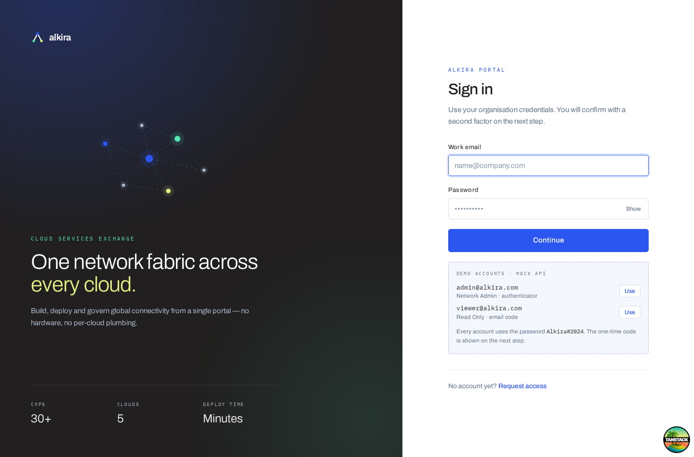
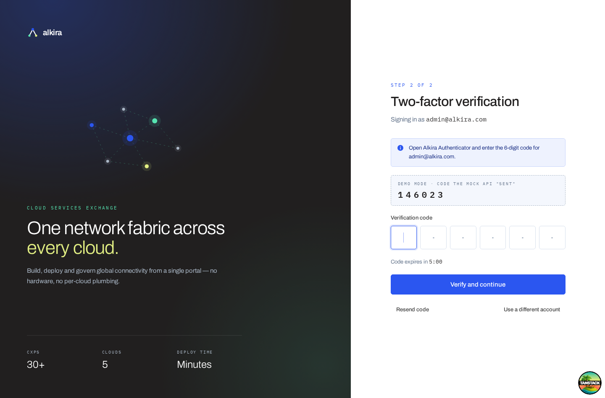
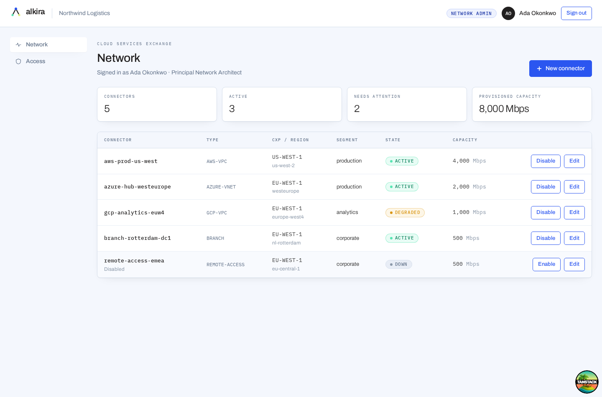
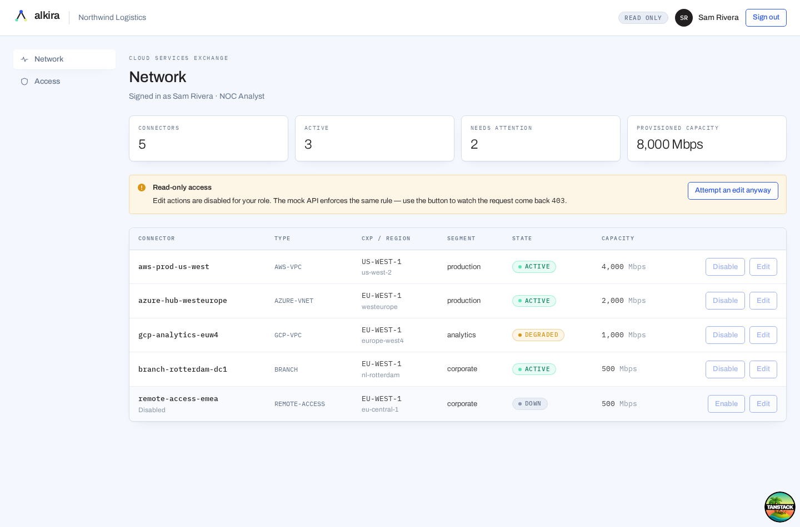
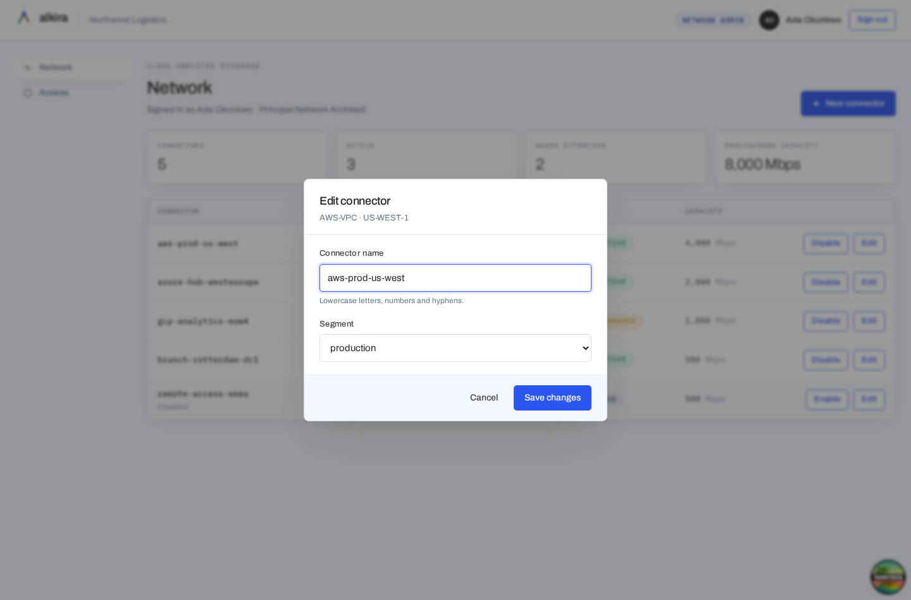
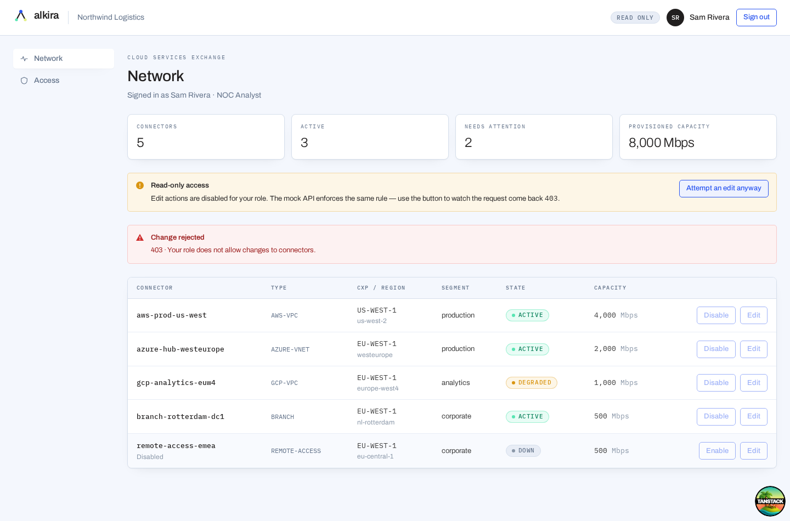
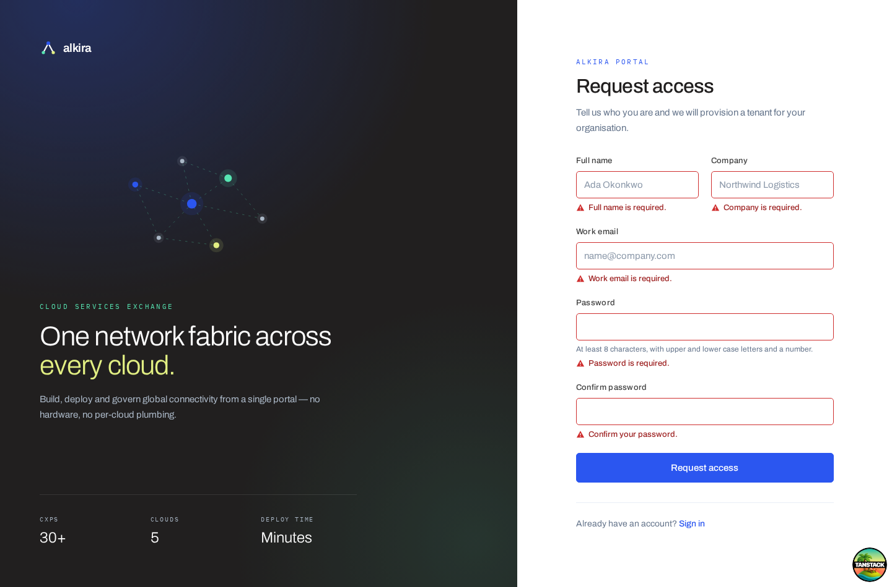
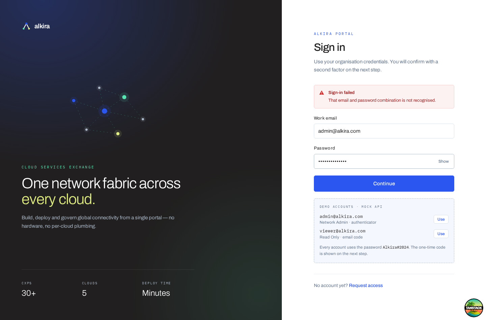

# Alkira Portal - authentication exercise

A small but complete authentication experience for a mock Alkira portal:
**Login → MFA → protected screen**, with a separate sign-up screen and
role-based access control on the protected screen.

Everything runs in the browser. A [MSW](https://mswjs.io) service worker plays
the part of backend server, including its failure modes.



---

## Contents

- [Technologies used](#technologies-used)
- [Setup](#setup)
- [Running locally](#running-locally)
- [Mock users and roles](#mock-users-and-roles)
- [Walking the login / MFA flow](#walking-the-login--mfa-flow)
- [Tests](#tests)
- [Demo walkthrough](#demo-walkthrough)
- [How it is put together](#how-it-is-put-together)
- [Key design decisions](#key-design-decisions)
- [Assumptions](#assumptions)
- [Known limitations](#known-limitations)

---

## Technologies used

| Area         | Choice                                                                                   |
| ------------ | ---------------------------------------------------------------------------------------- |
| UI           | React 19                                                                                 |
| Routing      | TanStack Router (file-based, with `beforeLoad` guards)                                   |
| Server state | TanStack Query (every API call goes through it)                                          |
| Client state | TanStack Store (session + pending MFA challenge)                                         |
| Styling      | Tailwind CSS v4, with Alkira's brand palette as design tokens                            |
| Mock API     | MSW - service worker in the browser, request interceptor in Node                         |
| Build        | Vite 8                                                                                   |
| Tests        | Vitest - jsdom project for units, **browser-mode (Playwright/Chromium) project for E2E** |
| Tooling      | TypeScript (strict + `noUncheckedIndexedAccess`), oxlint, oxfmt                          |

No component library is used. The handful of primitives the app needs
(`Button`, `TextField`, `OtpInput`, `Modal`, `Callout`, `Badge`, `Tooltip`)
live in `src/components/ui/`

## Setup

Requires **Node 20+** and **pnpm**.

```bash
pnpm install
```

Then install the browser used by the E2E suite (one-off, ~110 MB):

```bash
pnpm exec playwright install chromium
```

> Not needed if you only intend to run `pnpm test:unit`.

## Running locally

```bash
pnpm dev
```

Open <http://localhost:3000>. The mock API starts with the app.

Other scripts:

| Command                  | What it does                                 |
| ------------------------ | -------------------------------------------- |
| `pnpm dev`               | Dev server on port 3000                      |
| `pnpm build`             | Production build                             |
| `pnpm preview`           | Serve the production build                   |
| `pnpm test`              | Unit + E2E                                   |
| `pnpm test:unit`         | jsdom project only (fast, no browser needed) |
| `pnpm test:e2e`          | Chromium browser project only                |
| `pnpm typecheck`         | `tsc --noEmit`                               |
| `pnpm lint` / `pnpm fmt` | oxlint / oxfmt                               |

## Mock users and roles

Both accounts use the password **`Alkira#2024`**.

| Email               | Role                           | Second factor     | Can do                                                |
| ------------------- | ------------------------------ | ----------------- | ----------------------------------------------------- |
| `admin@alkira.com`  | **Network Admin** (read/write) | Authenticator app | Read, create, edit, enable/disable, delete connectors |
| `viewer@alkira.com` | **Read Only**                  | Emailed code      | Read connectors only                                  |

You do not have to type these, the sign-in screen has a **Demo accounts**
panel with a _Use_ button for each, and the one-time code is displayed on the
MFA screen (see below).

Roles map to permissions in `src/features/auth/permissions.ts`. Components ask
`can(user, 'connector:update')`, never `user.role === 'admin'`, so adding a
third role is a one-line change. The signed-in user's effective permissions are
listed on the **Access** screen.

## Walking the login / MFA flow

1. `pnpm dev`, open <http://localhost:3000>. You land on `/login` (the guard
   bounced you off `/` and remembered where you were going).
2. Click **Use** next to `admin@alkira.com`, then **Continue**.
3. You are now on `/mfa`. Because there is no real mail server, the code the
   mock API "sent" is shown in the dashed **Demo mode** box.
4. Type it into the six-digit field. It verifies automatically on the last
   digit, and you land on the protected **Network** screen.
5. Click **Sign out**, then repeat with `viewer@alkira.com` to see the
   read-only experience.

Things worth trying while you are in there:

| Try this                                  | What happens                                                                                                           |
| ----------------------------------------- | ---------------------------------------------------------------------------------------------------------------------- |
| Submit the empty sign-in form             | Per-field messages, no request sent                                                                                    |
| `not-an-email` as the email               | Format message on blur and on submit                                                                                   |
| A correct email with the wrong password   | `That email and password combination is not recognised` - deliberately identical to the message for an unknown account |
| The same wrong password 5×                | Account locks (`423`)                                                                                                  |
| A wrong OTP                               | `That code is not correct. 4 attempts remaining` - the counter decrements                                              |
| 5 wrong OTPs                              | Challenge is burned, you restart at `/login`                                                                           |
| Wait 5 minutes on `/mfa`                  | Code expires, field disables, **Resend code** issues a new one                                                         |
| Reload the page mid-MFA                   | The challenge survives; you stay on `/mfa`                                                                             |
| Navigate to `/` while MFA is outstanding  | You are returned to `/mfa`, not let through                                                                            |
| As the viewer, **Attempt an edit anyway** | The API returns `403` and the optimistic update rolls back                                                             |

## Tests

```bash
pnpm test        # 78 tests, ~15s
```

Two Vitest projects, configured in `vite.config.ts`:

**`unit`** (jsdom) - 57 tests

- `validation.test.ts` - every rule and message, including the deliberate
  choice _not_ to enforce composition rules at sign-in
- `permissions.test.ts` - the role→permission matrix, including that no role
  can reference a permission that does not exist
- `auth-store.test.ts` - state transitions, sessionStorage persistence,
  rehydration of an unexpired challenge and discarding of an expired one
- `safe-redirect.test.ts` - open-redirect rejection
- `LoginForm.test.tsx` - the form mounted inside the real router against the
  real mock API: validation, error handling, lockout, advancing to MFA
- `ConnectorTable.test.tsx` - the read-only vs read/write rendering contract

**`e2e`** (real Chromium, real service worker) - 21 tests

- `auth-flow.test.tsx` - the full journey, MFA cannot be skipped, wrong codes,
  attempt exhaustion, resend, redirect-back-to-destination, sign-out, and the
  whole sign-up flow
- `access-control.test.tsx` - admin renames/disables a connector, server-side
  name validation, and the read-only counterparts including the `403`

Both projects mount the **real application** the production `createRouter`
wiring, the real guards, the real MSW API via `test/render-app.tsx`, only
swapping browser history for memory history. The tests therefore exercise the
same path a user does rather than a hand-assembled subset of it.

## Demo walkthrough

Screenshots of each required scenario are in `docs/screenshots/`.

**Login and MFA**

| Sign in                                   | Two-factor step                     |
| ----------------------------------------- | ----------------------------------- |
|  |  |

**Read/write vs read-only**

| Network Admin - actions enabled, _New connector_ offered    | Read Only - actions disabled, _New connector_ hidden               |
| ----------------------------------------------------------- | ------------------------------------------------------------------ |
|  |  |

| Editing a connector (admin)                         | The API refusing a read-only write           |
| --------------------------------------------------- | -------------------------------------------- |
|  |  |

**Validation and error handling**

| Field validation                                                 | API error                                                   |
| ---------------------------------------------------------------- | ----------------------------------------------------------- |
|  |  |

## How it is put together

```
src/
  routes/                     file-based routes
    __root.tsx                shell + 404
    login.tsx  mfa.tsx  signup.tsx
    _authenticated.tsx        pathless layout: the access-control boundary
    _authenticated/
      index.tsx               protected Network screen
      account.tsx             profile + effective permissions
  features/
    auth/
      types.ts  validation.ts  permissions.ts
      auth-store.ts           session state (TanStack Store)
      api.ts                  TanStack Query options + mutation fns
      restore.ts              resolves a persisted token on boot
      use-permission.tsx      usePermission() / <Can>
      components/             LoginForm, MfaForm, SignupForm
    network/
      types.ts  api.ts  components/
  components/                 AppShell, AuthLayout, BrandMark, ui/
  lib/                        api-client, use-form, cn, safe-redirect
  mocks/                      db, handlers, browser + node setups, demo helpers
test/                         shared render harness and setup files
e2e/                          browser-mode specs
```

The route tree (`src/routeTree.gen.ts`) is generated by the TanStack Router
Vite plugin; it regenerates on `pnpm dev` / `pnpm build`, or on demand with
`pnpm generate-routes`.

## Key design decisions

**Guards live on a pathless layout route, not in components.**
`_authenticated.tsx` runs one `beforeLoad`, so protected data is never fetched
for an anonymous visitor and no child route can forget to protect itself.
Adding a protected screen means adding a file under `_authenticated/`.

**Auth state is a TanStack Store, not React context.** Guards run outside of
React and need a _synchronous_ read of the session. The router subscribes to
the store and invalidates on change, so signing out re-runs the guards
immediately rather than at the next navigation.

**Permissions, not roles, at the call site.** `can(user, 'connector:update')`
throughout. Roles are just named bundles of permissions in one file.

**Access control is enforced twice, on purpose.** The UI disables what you
cannot do, _and_ the mock API returns `403` for the same operation.

**Read-only actions are disabled and explained, not hidden.** A disabled
_Edit_ with a tooltip tells the user _why_ their screen differs from a
colleague's. Creation is hidden instead, because a greyed-out _New connector_
has nothing useful to say. The brief allowed either; the app uses both, chosen
per control.

**Validation is pure functions, shared with the mock backend.**
`src/features/auth/validation.ts` has no React in it, so it unit-tests
directly and `src/mocks/handlers.ts` imports the same functions to reject
malformed requests.

**Sign-in does not apply password composition rules.** Length only. Enforcing
"needs an uppercase and a digit" at sign-in would lock out existing accounts
after a policy change and hints at the shape of a valid password. Sign-up, where
we control the new secret, does enforce them.

**Error visibility follows the usual convention.** Nothing is flagged while a
field is first being filled in; a field validates once blurred; after a submit
attempt everything validates live so the form visibly resolves as it is fixed.
Server-side field errors always override client ones and clear when you edit
that field.

**The OTP input is one real `<input>` behind a segmented display.** Six separate
boxes break paste, `autocomplete="one-time-code"`, and screen readers. One input
positioned transparently over six cells keeps all of that working and still
looks like a code field. It submits itself on the last digit.

**Optimistic updates with rollback** on the connector mutation, which is what
makes the read-only `403` demo legible: the row flips, then flips back.

## Assumptions

- **No real backend, and none is being stood up.** Tokens are opaque strings
  from `crypto.getRandomValues`, not JWTs; the mock DB is module-level state
  that resets on reload.
- **Sign-up ends at a confirmation.** The brief said full registration was not
  required, so it validates, calls the API (including a real `409` for a taken
  email) and confirms. It does not provision an account.
- **The one-time code is displayed on screen.** There is no mail server or TOTP
  seed, so the mock API returns the code it "sent" in a `devCode` field, which
  the UI shows behind a clearly-labelled demo panel. `admin@` is modelled as an
  authenticator user and `viewer@` as an email-code user purely to show both
  copy variants; the mechanics are identical.
- **`sessionStorage`, not `localStorage`**, for the token a demo session
  should not outlive the tab. In production this would be an HttpOnly cookie
  (see limitations).
- **Two roles.** The brief asked for read-only and read/write; the permission
  layer generalises past that, but only two are seeded.

## Known limitations

- **Storing a token in `sessionStorage` is XSS-exposed.** A real deployment
  should use an HttpOnly, Secure, SameSite cookie issued by the server. It is
  done this way here because there _is_ no server.
- **The MFA "code" is on screen.** Obviously not a second factor. Real TOTP
  needs a shared secret and a server-side clock; real email/SMS codes need a
  delivery channel.
- **Account lockout and attempt counters are per browser session** and reset on
  reload, since the mock DB is in memory.
- **MSW ships in the production bundle** (~420 kB of the build). Building a
  genuinely deployable artifact would mean gating the mock behind an env flag
  and pointing the API layer at a real origin.
- **No refresh-token rotation or idle timeout.** The session lasts until
  sign-out or tab close.
- **The E2E suite drives the app in a real browser but mounts it in-process**
  rather than navigating a deployed URL, so it does not cover the `index.html`
  bootstrap, the service-worker registration itself, or hard page reloads.
- **Accessibility has been handled but not audited.** Labels, `aria-invalid`,
  `aria-describedby`, `role="alert"` on errors, a native `<dialog>` for focus
  trapping, visible focus rings and a reduced-motion rule are all in place; no
  screen-reader pass or automated axe run has been done.
- **No responsive design below ~380 px**, and the sidebar navigation collapses
  out of view on small screens rather than becoming a menu.
- **Fonts load from Google Fonts**, so first paint offline falls back to system
  sans.
